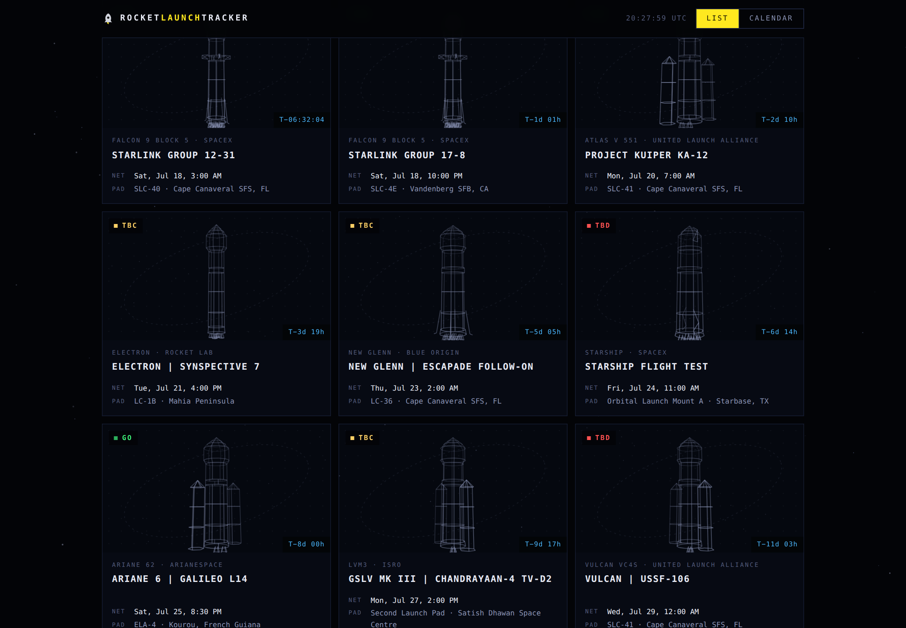

# 🚀 Rocket Launch Tracker

**rocketlaunchtracker.com** — live countdown, schedule and calendar for every upcoming rocket launch worldwide.

Static site, zero build step, free hosting on GitHub Pages. Launch data streams from [Launch Library 2](https://thespacedevs.com/llapi) by The Space Devs and is auto-refreshed every 6 hours by a GitHub Action.



## Features

- **T‑minus hero countdown** to the very next liftoff, with webcast link
- **List view** — filterable cards (provider, status, free-text search) with per-launch mini countdowns
- **Calendar view** — real month grid, launches on their dates, in *your* timezone
- **Mission popups** — description, pad + map, weather-go probability, window, webcasts, one‑click **Add to Google Calendar**
- **"Reading the board"** — explains Go/TBC/TBD, NET and T‑minus for newcomers
- No frameworks, one HTML/CSS/JS page, loads fast, works on phones

## How the data flows

```
The Space Devs LL2 API ──(GitHub Action, every 6h)──▶ data/launches.json ──▶ your visitors
                        └─(live fallback: browser fetches API directly if the cache is stale/missing)
```

The committed `data/launches.json` starts as **sample data** (marked `"sample": true`). The moment the site is opened it pulls live data, and the first Action run replaces the file with the real feed.

## Deploy on GitHub Pages (5 minutes)

1. Create a new GitHub repo (e.g. `rocket-launch-tracker`) and push this folder:
   ```bash
   git init && git add -A && git commit -m "Liftoff 🚀"
   git branch -M main
   git remote add origin https://github.com/YOUR_USERNAME/rocket-launch-tracker.git
   git push -u origin main
   ```
2. Repo **Settings → Pages** → Source: *Deploy from a branch* → Branch: `main` / `/ (root)` → Save.
3. Repo **Settings → Actions → General** → Workflow permissions: **Read and write** (lets the data-refresh Action commit). Then open the **Actions** tab → *Update launch data* → **Run workflow** once to pull real data.
4. Site is live at `https://YOUR_USERNAME.github.io/rocket-launch-tracker/` within a minute or two.

## Point your domain at it

Once you've bought your domain (e.g. `rocketlaunchtracker.com`):

1. Create a file named `CNAME` in the repo root containing just your domain (one line, no `https://`). Then GitHub repo **Settings → Pages → Custom domain** → enter the same domain → Save.
2. At your registrar (GoDaddy: *My Products → DNS*), add:

   | Type  | Name | Value                    |
   |-------|------|--------------------------|
   | A     | @    | `185.199.108.153`        |
   | A     | @    | `185.199.109.153`        |
   | A     | @    | `185.199.110.153`        |
   | A     | @    | `185.199.111.153`        |
   | CNAME | www  | `YOUR_USERNAME.github.io.` |

   (Remove any conflicting default A / "Parked" records first.)
3. Back in GitHub Pages settings, tick **Enforce HTTPS** once the DNS check passes (can take from minutes up to a few hours).
4. Update the `og:url` / `canonical` tags in `index.html` if you chose a different domain.

## Run locally

Any static server works:

```bash
cd rocket-launch-tracker
python3 -m http.server 8000
# → http://localhost:8000
```

(Opening `index.html` directly with `file://` also works — the app skips the local cache and calls the live API.)

## Customize

- **Colors / theme** — every color is a CSS custom property at the top of `css/style.css` ("Galactic" palette — Star Wars-inspired yellow-on-black with saber-glow statuses).
- **Refresh cadence** — edit the cron in `.github/workflows/update-launches.yml` (LL2's free tier allows 15 calls/hour per IP; 6-hourly is polite).
- **More launches** — bump `limit=60` in the workflow + `js/app.js`.
- **Site name / domain** — `CNAME`, plus the `<title>`/meta tags in `index.html`.

## SEO checklist (after the site is live)

1. **Google Search Console** → add property `rocketlaunchtracker.com` (DNS verification at GoDaddy) → submit `sitemap.xml`.
2. Bing Webmaster Tools → import from Search Console (one click).
3. The site already ships: keyword-tuned title/meta, OpenGraph/Twitter cards with image, `Event` structured data for the next 20 launches (JSON-LD, refreshed with the data), `WebSite`+`SearchAction` schema (`/?q=falcon` deep-links into search), semantic H1, alt text on all images, `robots.txt` + `sitemap.xml`, canonical URL, fast no-framework loads.
4. Freshness is the play: the 6-hour data refresh keeps the page changing, which keeps crawlers coming back. Post the link where spacefans live (r/spacex, r/rocketlaunches, forum signatures) — a few real links beat everything else.

## Credits

Launch data © [The Space Devs — Launch Library 2](https://thespacedevs.com/llapi) (free, attribution appreciated). Fonts: Oswald, Inter, IBM Plex Mono via Google Fonts. Not affiliated with any launch provider.
